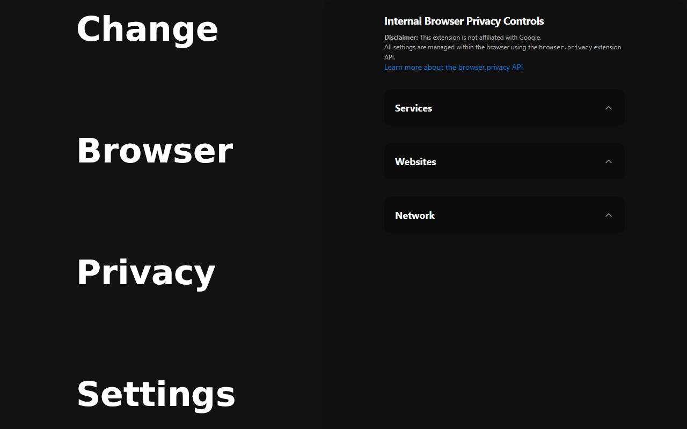

## Browser Privacy Controls
<p float="left">
<a href="https://chrome.google.com/webstore/detail/" style="text-decoration: none;">

</a>
<a href="https://microsoftedge.microsoft.com/addons/detail/" style="text-decoration: none;">

</a>
</p>

Manage Chromium-based browser's privacy settings.


Note: It should work on any Chromium-based browser, but has only been tested on Chrome and Edge.


This extension is not affiliated with Google or Microsoft.

### Building

To build and load the extension from source run:

```
degit <github-username>/<repo-name> <folder-name>

pnpm install

pnpm run build

go to chrome://extensions/ (enable developer mode)

load unpacked folder <folder-name>/.output/chrome-mv3
```


### Acknowledgements

[Aklinker1](https://github.com/sponsors/aklinker1) making extension development fun:
- [WXT](https://wxt.dev/)
- [webext-core](https://github.com/aklinker1/webext-core)
- [publish-browser-extension](https://github.com/aklinker1/publish-browser-extension)

[Antfu's](https://github.com/sponsors/antfu) really cool projects:
- [eslint-config](https://github.com/antfu/eslint-config)
- [UnoCSS](https://unocss.dev/)
- [unimport](https://github.com/unjs/unimport)

[Svelte](https://svelte.dev/)